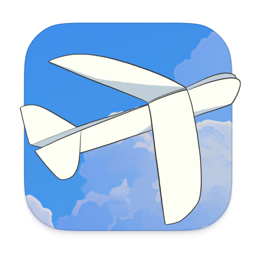

# Deta Surf

Notebooks for the internet – now in open beta!

## What is Surf?

[Surf](https://deta.surf) is a tool for thought — like a personal notebook — but for a multi-media world that includes websites, YouTube videos, PDFs, photos, files & more. Surf helps you manage it all in one place, and generate notes to think on top of it.

Learn more on [why we are building Surf](https://deta.surf/motivation).

## Installation

Checkout the [GitHub releases](https://github.com/deta/surf/releases) for the latest stable version of Surf for MacOS, Windows and Linux.

You can also download Surf with some managed & additional features (e.g. AI) from the Deta website. That version is subject to the [Deta Terms](https://deta.surf/terms).

For building from source and local development, see [CONTRIBUTING.md](CONTRIBUTING.md).

## Philosophy

Surf is designed to give end users as much agency possible. We think tools for thinking are too important & too personal to be overly centralized and closed.

**Personal**

The user’s thought process should be at the center of the experience. This means local first data storage, but should also reflect in the user experience.

**Open**

Users should be able to operate _multi_-media, all in one place. They should have agency over their data, source code, and external service providers.

**Intelligent**

Many of the experiences in Surf are designed to use AI, but Surf is intended to augment human intelligence, not automate it.

## Features

### Generative Notes

Generate & edit notes that weave your photos, websites, PDFs, YouTube videos & more directly together.

<SMART NOTES IMG>

**Citations**

Notes deeply link back to specific sections of PDFs, webpages, or YouTube videos from which they were generated.

**@ mentions**

@ mention anything in your library to add something to context and use it to generate notes out of.

### Universal Navigation

Open a note, PDF, image, file, website or YouTube video in a tab or a split, with the same navigation affordances, regardless of media type.

### Multi-media memory

<MEMORY IMG>

You can add many different “objects” to Surf’s memory. Each object lives on your device in local and open data formats: a database entry, a file, and a vector embedding.

Special support has been created for:

- Files
  - Photos
  - PDFs
- Web Resources
  - Blog Articles
  - Wikipedia Pages
  - YouTube Videos (automatic transcript recognition)
  - Tweets
  - Notion Documents
- Native Media
  - Surflets
  - Smart Notes

### Notebooks

Organize your information into multi-media notebooks for specific topics that interest you.

<NOTEBOOKs IMG>

### Surflets

Surf can code interactive applets to help you visualize, understand or explore.

<SURFLETS IMG>

## Contributing

See [CONTRIBUTING.md](CONTRIBUTING.md) for details on contributing to the project and an overview of the codebase.

## Code of Conduct

See [CODE_OF_CONDUCT.md](CODE_OF_CONDUCT.md) for details on our code of conduct.

## License

This project is licensed under the Apache 2.0 license. See [LICENSE](LICENSE) for more details.
